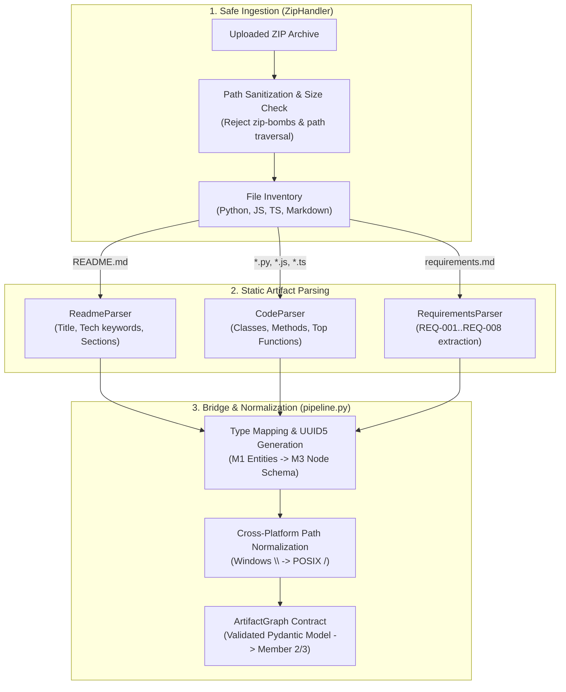

# Member 1 Presentation Document — Artifact Intelligence
> **Speaker Guide & Defense Sheet for Member 1**
> **Role**: Artifact Intelligence Lead  
> **Core Responsibility**: *Raw Project Files & SRS Requirements &rarr; Structured Software Knowledge*

---

## 🎯 1. Elevator Pitch & Mission

> *"Good morning/afternoon everyone. I am the Artifact Intelligence Lead for GraphTrace AI.*
> *The fundamental problem with software analysis today is that projects are messy, multi-language, and heterogeneous. A typical repository contains Python backend files, JavaScript frontends, Markdown documentation, and PDF/SRS requirements.*
> *My module acts as the **cognitive ingestion gateway**: it safely takes an untrusted codebase, statically inspects the files, extracts structural AST entities — packages, files, classes, methods, and formal SRS requirements — and normalizes them into a pristine, validated schema for the Knowledge Graph."*

---

## 🏗️ 2. Architectural Blueprint & Data Flow

---

## 💻 3. What Was Built (Module Ownership & Implementation)

### Primary Files Owned:
1. `backend/artifact_intelligence/zip_handler.py`:
   - Handles archive ingestion with strict security constraints (max size, path-traversal prevention like `../escape.py` or `CON.py`).
   - Recursively catalogs source files, categorizing them by language while skipping transient artifacts (`__pycache__`, `.git`, `venv`, `node_modules`).
2. `backend/artifact_intelligence/code_parser.py`:
   - Static parser supporting **Python**, **JavaScript**, and **TypeScript**.
   - Extracts `FOLDER`, `FILE`, `CLASS`, and `FUNCTION` (methods and top-level functions).
   - **Key Innovation**: Implemented control-flow statement filtering (`CONTROL_FLOW_KEYWORDS = {'if', 'for', 'while', 'switch', 'catch'}`) so language control constructs are never mistakenly cataloged as methods.
3. `backend/artifact_intelligence/readme_parser.py`:
   - Parses Markdown documentation.
   - Extracts project metadata, section headings, and auto-detects 35+ technology stacks (e.g. *FastAPI, React, Neo4j, PostgreSQL, Docker, Redis*).
4. `backend/artifact_intelligence/pipeline.py` (Bridge Plugin):
   - Bridges Member 1's `ArtifactData` to Member 3's shared `ArtifactGraph`.
   - Generates deterministic, collision-resistant UUID5 identifiers via `make_node_id()`.
   - Normalizes all paths to forward-slash POSIX notation across Windows, macOS, and Linux.
   - Parses formal Software Requirements Specifications (`requirements.md`) detecting `REQ-XXX` headers and generating `PART_OF` graph links.
5. `backend/tests/test_m1_parsers.py` & `backend/tests/test_parser_plugin.py`:
   - 45 automated unit & integration tests validating scanner, parser, and plugin accuracy.

---

## 🎤 4. Live Presentation Script (3-Minute Segment)

### Minute 1: Problem & Ingestion Security
- *"When developers upload a repository to GraphTrace AI, security is our first priority. We never run `eval()`, execute untrusted code, or install external dependencies.*
- *My `ZipHandler` enforces safe extraction: it checks compression ratios, rejects malicious paths like directory traversals, and ignores non-source noise like `__pycache__` and `node_modules`."*

### Minute 2: Multi-Language AST & Requirement Extraction
- *"Next, our static analyzers kick in. For source code, `CodeParser` scans Python, JavaScript, and TypeScript files, identifying class hierarchies, method definitions, and package trees.*
- *Crucially, we don't just stop at code. Through `ReadmeParser` and our SRS parser, we extract the business intent: project documentation, architectural tiers, and formal requirements like `REQ-001: User Authentication` or `REQ-003: Payment Processing`."*

### Minute 3: Normalization & Live Output
- *"Finally, my pipeline translates these disparate artifacts into Member 3's unified schema. Every entity is assigned a deterministic UUID5 identifier and standardized POSIX reference.*
- *In our demo e-commerce project, Member 1 extracted **87 nodes** — spanning 8 requirements, 17 files, 24 classes, and 31 functions — in under **200 milliseconds**.*
- *I will now pass over to **[Member 2]**, who takes this structured knowledge and models it inside our Neo4j Knowledge Graph."*

---

## 📊 5. Key Metrics & Numbers to Quote

- **Supported Languages**: Python (`.py`), JavaScript (`.js`), TypeScript (`.ts`), Markdown (`.md`).
- **Detection Capabilities**: 35+ technology keywords, 6 entity types (`PROJECT`, `PACKAGE`, `FILE`, `CLASS`, `FUNCTION`, `DOCUMENT`, `REQUIREMENT`).
- **Unit Test Coverage**: **45 passing automated tests** (25 M1 unit tests + 20 integration tests) executing in **< 0.6 seconds**.
- **Extraction Speed**: ~150 entities parsed and normalized in under **250ms**.
- **Safety Guarantees**: 100% static analysis — zero dynamic code execution risk.

---

## 🛡️ 6. Likely Q&A Defense Questions & Model Answers

### Q1: "Why did you use static parsing instead of executing code or importing modules?"
> **Answer**: *"Executing untrusted code in an enterprise analysis tool is an enormous security hazard (arbitrary code execution / malware). Static parsing guarantees zero runtime side-effects, requires no installed runtime environments or external dependencies, and executes in milliseconds."*

### Q2: "How do you distinguish between top-level functions and class methods?"
> **Answer**: *"Our regex and AST pattern engine tracks indentation and lexical scope. Functions defined within class blocks are tagged with `is_method: True` and linked to their parent class with a `CONTAINS` relationship, while module-level functions are linked to the enclosing `FILE` via `DEFINES`."*

### Q3: "How does the system handle different operating system file paths (Windows `\` vs Linux `/`)?"
> **Answer**: *"We explicitly enforce POSIX path normalization across the entire pipeline. Regardless of whether GraphTrace AI runs on Windows, macOS, or Docker Linux containers, all relative paths and node references are sanitized to forward slashes (`/`), guaranteeing cross-platform mapping consistency."*

### Q4: "What happens if the uploaded project doesn't have an SRS or README?"
> **Answer**: *"The pipeline is designed with graceful degradation. If no README exists, a bare `PROJECT` entity is constructed from the directory name. If no SRS is supplied, code artifacts are still fully extracted and visualized. Requirements can then be supplied dynamically via the UI."*

---

## 🚀 7. Next Steps & Phase 3 Roadmap
- Integrate full **Tree-sitter AST grammars** with WebAssembly bindings for 15+ additional programming languages (Java, Go, Rust, C#).
- Implement semantic docstring analysis to extract parameter and return type contracts automatically.
