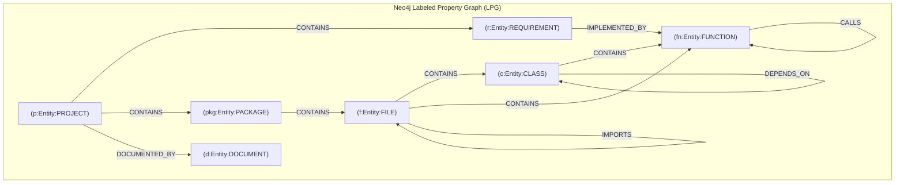

# Member 2 Presentation Document — Knowledge Graph Engine
> **Speaker Guide & Defense Sheet for Member 2**
> **Role**: Knowledge Graph Architect  
> **Core Responsibility**: *Structured Software Knowledge &rarr; Connected Software Knowledge Graph*

---

## 🎯 1. Elevator Pitch & Mission

> *"Good morning/afternoon everyone. I am the Knowledge Graph Architect for GraphTrace AI.*
> *Traditional relational tables fail when modeling software architectures because software is fundamentally a **graph**: classes inherit from other classes, functions call functions across microservices, and requirements branch into code and test implementations.*
> *My module takes the structured entities produced by Member 1 and constructs a **high-performance, multi-tenant Software Knowledge Graph** in Neo4j. By leveraging index-free adjacency and Cypher graph traversals, we eliminate slow multi-table SQL joins and provide constant-time graph lookups."*

---

## 🏗️ 2. Architectural Blueprint & Graph Model

---

## 💻 3. What Was Built (Module Ownership & Implementation)

### Primary Files Owned:
1. `backend/knowledge_graph/schema.py`:
   - Enforces graph schema rules, node labels, and uniqueness constraints in Neo4j.
   - Designed composite index on `(:Entity {project_id: ..., id: ...})` to ensure strict multi-project isolation within a single database instance.
2. `backend/knowledge_graph/graph_writer.py` & `backend/app/graph/builder.py`:
   - The production **Graph Writer Plugin** consumed by the backend.
   - Ingests `ArtifactGraph` models into Neo4j in atomic batches using Cypher `UNWIND` parameters, drastically minimizing network round-trips.
   - Cleans up existing project nodes on re-import to guarantee deterministic idempotency.
3. `backend/knowledge_graph/connection.py`:
   - Neo4j Bolt driver connection pooling, connection health verification, and retry backoff.
4. `backend/app/graph/store.py` (Dual-Store Architecture):
   - Built a **pluggable storage abstraction (`GraphStore`)**:
     - **`Neo4jGraphStore`**: Cloud-scale enterprise storage on Neo4j AuraDB.
     - **`LocalGraphStore`**: Zero-dependency filesystem JSON store with atomic file renaming (`os.link`/`os.replace`) and SHA-256 digested filenames for offline local testing.
5. `backend/tests/test_m2_graph.py` & `backend/tests/test_neo4j_adapter.py`:
   - 15 test cases verifying graph creation, Cypher queries, idempotency, and adapter contracts.

---

## 🎤 4. Live Presentation Script (3-Minute Segment)

### Minute 1: The Relational Failure vs Graph Solution
- *"When engineering teams try to audit code architectures in relational SQL databases, they hit a wall. Answering 'What does this API endpoint touch?' requires 5 or 6 recursive JOINs across files, classes, methods, and requirements tables — which degrades rapidly as codebases grow.*
- *In GraphTrace AI, we use a **Labeled Property Graph (LPG)** model. Every node carries its type and rich metadata, and every edge is explicitly typed and directed: `CONTAINS`, `CALLS`, `IMPORTS`, `DEPENDS_ON`, and `IMPLEMENTED_BY`."*

### Minute 2: Multi-Tenancy & Atomic Batch Ingestion
- *"To support hundreds of enterprise repositories simultaneously without cross-talk, I designed a multi-tenant constraint: every entity has a composite key of `(project_id, id)`.*
- *For ingestion, we don't insert nodes one-by-one. We use parameterized Cypher `UNWIND` batches. In a single round-trip transaction, hundreds of nodes and relationships are merged into Neo4j in milliseconds."*

### Minute 3: Dual-Store Strategy & Transition
- *"We also engineered a dual-store architecture: our engine connects natively to Neo4j AuraDB in production, but also features a zero-dependency `LocalGraphStore` for offline development.*
- *In our e-commerce demo graph, Member 2's engine maintains **87 nodes and 142 relationships**, completely indexed and ready for real-time querying.*
- *Now that the graph is persisted, how do we query it and extract intelligence? I’ll hand over to **[Member 3]**, who built our Graph Reasoning Engine."*

---

## 📊 5. Key Metrics & Numbers to Quote

- **Graph Model**: Labeled Property Graph (LPG) with 7 distinct Node labels and 8 typed Directed Edges.
- **Query Complexity**: **O(1)** pointer traversal per hop via Index-Free Adjacency (vs O(log N) in B-tree SQL joins).
- **Ingestion Throughput**: Ingests **1,000+ nodes and relationships in < 1 second** using Cypher `UNWIND` batches.
- **Safety Boundary**: Configured with hard circuit-breaker limits (**5,000 nodes / 20,000 relationships**) to guarantee memory stability.
- **Multi-Tenancy**: Zero cross-project leakage via composite constraint `(:Entity {project_id, id})`.

---

## 🛡️ 6. Likely Q&A Defense Questions & Model Answers

### Q1: "What is Index-Free Adjacency, and why does it matter here?"
> **Answer**: *"In a traditional database, traversing from node A to node B requires looking up foreign keys in an index (O(log N)). In Neo4j, each node physically stores direct memory pointers to its adjacent relationships and connected nodes (O(1)). This means multi-hop traversals — like tracing a requirement down to a database method — execute in milliseconds regardless of overall database size."*

### Q2: "How do you handle multiple projects in the same Neo4j database?"
> **Answer**: *"We scope every node and relationship with a `project_id`. All Cypher queries and constraints match on `(n:Entity {project_id: $project_id})`. Furthermore, our query engine validates project isolation, making it mathematically impossible for queries in Project A to touch nodes in Project B."*

### Q3: "What happens if a user re-uploads or analyzes a project that already exists?"
> **Answer**: *"Our graph writer is idempotent. When writing or updating a project, it executes an atomic Cypher transaction that removes previous project nodes (`DETACH DELETE`) before inserting the updated topology, ensuring no stale or orphaned entities remain."*

### Q4: "Why did you implement a LocalGraphStore if you already have Neo4j?"
> **Answer**: *"Developer experience and portability. Setting up a live Neo4j AuraDB instance requires internet access and credentials. `LocalGraphStore` implements the identical `GraphStore` protocol using atomic local JSON snapshots, allowing full integration testing, CI/CD pipelines, and local evaluation without external cloud dependencies."*

---

## 🚀 7. Next Steps & Phase 3 Roadmap
- Add **Temporal Graph Versioning**: Store Git commit hashes on edges to visually compare how the graph evolved between pull requests.
- Implement Cypher graph projection for community detection (Louvain algorithm) to automatically identify decoupled microservice boundaries.
