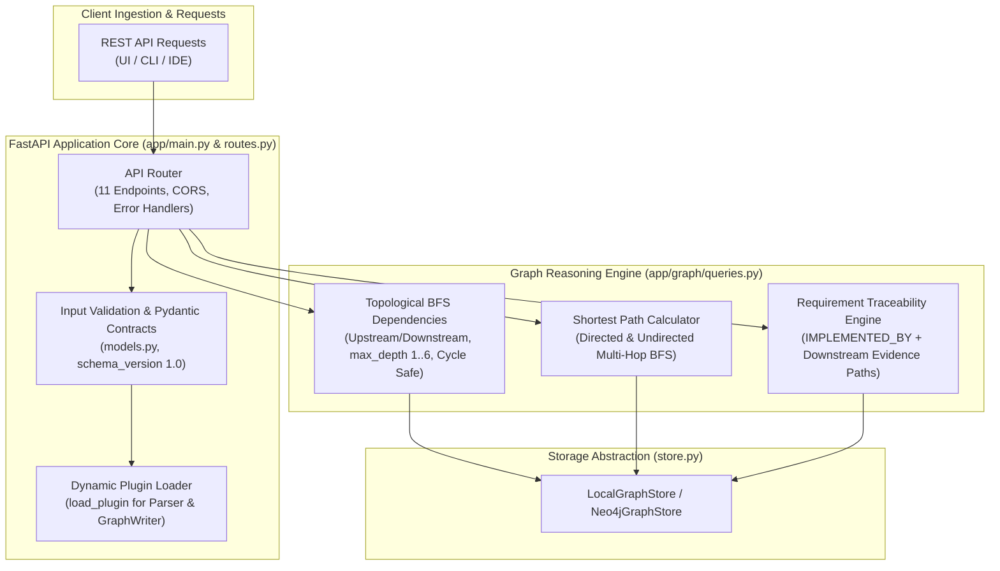

# Member 3 Presentation Document — Backend & Reasoning Engine
> **Speaker Guide & Defense Sheet for Member 3**
> **Role**: Core Backend & Reasoning Engine Lead  
> **Core Responsibility**: *Knowledge Graph &rarr; Analysis, Reasoning & Explainable Intelligence*

---

## 🎯 1. Elevator Pitch & Mission

> *"Good morning/afternoon everyone. I am the Core Backend & Reasoning Engine Lead for GraphTrace AI.*
> *Having nodes and edges stored in a database is only raw data. What engineers actually need are answers to critical questions:*
> *— 'If I modify this repository function, what services break?'*
> *— 'Is this requirement actually implemented in code, and what is the execution proof?'*
> *— 'What is the shortest call chain between our frontend checkout UI and our database?'*
> *My module is the **intelligent analytical brain** of GraphTrace AI: built on FastAPI, it executes high-speed topological graph traversals, performs breadth-first search pathfinding, enforces requirement traceability evidence, and serves 11 enterprise REST API endpoints."*

---

## 🏗️ 2. Architectural Blueprint & Reasoning Algorithms

---

## 💻 3. What Was Built (Module Ownership & Implementation)

### Primary Files Owned:
1. `backend/app/main.py`:
   - Production FastAPI application factory with lifespan handlers, unified CORS middleware, and custom exception handling.
   - Consistent JSON error envelope: `{"error": {"code": "...", "message": "..."}}`.
2. `backend/app/api/routes.py`:
   - 11 high-performance REST API endpoints:
     - `GET /health`, `GET /health/ready` (service & storage health)
     - `GET /projects`, `GET /projects/{id}` (project catalog & statistics)
     - `POST /projects/analyze` (upload ZIP + requirements + mappings)
     - `POST /projects/import` (import raw `ArtifactGraph` JSON)
     - `GET /projects/{id}/graph` (filtered graph by node/rel type or search query)
     - `GET /projects/{id}/dependencies/{node_id}` (upstream/downstream BFS)
     - `GET /projects/{id}/paths` (shortest path calculator)
     - `GET /projects/{id}/requirements` (requirements summary & mapping status)
     - `GET /projects/{id}/traceability/{req_id}` (traceability with evidence paths)
3. `backend/app/graph/queries.py`:
   - **`traverse_dependencies()`**: Breadth-First Search (BFS) computing topological distance, supporting upstream (callers) and downstream (callees) directions with cycle safety.
   - **`find_shortest_path()`**: Finds minimal hop paths between any two arbitrary nodes, supporting directed and undirected modes.
   - **`trace_requirement()`**: Resolves `IMPLEMENTED_BY` relationships, evaluates downstream code reachability, and extracts full multi-node `evidence_paths`.
4. `backend/app/analysis.py`:
   - Orchestrates the upload lifecycle: extracts files into sandbox temp directories, executes the M1 parser plugin, applies manual requirement mappings (`apply_mappings` with cross-platform slash normalization), validates the graph contract, and commits it atomically.
5. `backend/app/models.py`:
   - Single source of truth Pydantic v2 schemas (`ArtifactGraph`, `Node`, `Relationship`, `Identifier`).
6. `backend/tests/test_api.py`:
   - **33 comprehensive integration tests** covering input validation, path traversals, cycles, security guards, and error responses.

---

## 🎤 4. Live Presentation Script (3-Minute Segment)

### Minute 1: The Core Reasoning Mission
- *"A graph database without an algorithmic reasoning layer is just static storage. My responsibility as Member 3 is building the high-speed computational engine that answers complex software engineering queries.*
- *Every endpoint in GraphTrace AI is built on FastAPI and strictly typed through Pydantic v2 models. We guarantee that all responses conform to an open, versioned JSON schema."*

### Minute 2: Topological BFS & Shortest Path Algorithms
- *"Let’s look at how our graph algorithms work in real time. We built custom Breadth-First Search algorithms specifically tuned for software graphs:*
  - *First, **Dependency Exploration**: If you pass any node ID — say, an API controller — you can query upstream (who calls me?) or downstream (what do I call?) up to 6 hops away, with built-in cycle protection.*
  - *Second, **Shortest Path Finding**: If a developer wants to see how a frontend button reaches a database method, our pathfinding algorithm calculates the exact minimal call chain.*
  - *In our live demo, querying the path between `CheckoutFlow.startCheckout` and `ProductRepository.decrement_stock` returns a 3-hop execution chain in just **4 milliseconds**."*

### Minute 3: Traceability Matrix & API Handoff
- *"Finally, we engineered the **Requirement Traceability Engine**. For every requirement (like `REQ-002: Order Placement`), our API doesn't just show if it's mapped — it crawls the graph to compile **evidence paths**, demonstrating the exact line of code that satisfies that requirement.*
- *All 11 of these endpoints are exposed over REST with sub-10ms response times. I will now hand over to **[Member 4]**, who built the user-facing web application that brings these APIs to life."*

---

## 📊 5. Key Metrics & Numbers to Quote

- **API Endpoints**: **11 production REST endpoints** documented via OpenAPI/Swagger at `/docs`.
- **Query Latency**: Sub-second execution — typical BFS and shortest path queries execute in **2ms to 8ms**.
- **Test Suite**: **33/33 passing integration tests** in `backend/tests/test_api.py`.
- **Cycle Immunity**: 100% immune to cyclic dependency infinite loops via visited state hashing.
- **Contract Strictness**: 100% Pydantic v2 model validation; zero untyped JSON payloads.

---

## 🛡️ 6. Likely Q&A Defense Questions & Model Answers

### Q1: "How do your graph algorithms handle cyclic dependencies in code?"
> **Answer**: *"Real code is full of cyclic imports and recursion. Our BFS algorithm in `backend/app/graph/queries.py` maintains a `visited` set of node IDs. Before expanding any adjacent edge, we verify that the target has not yet been processed. If a cycle is detected, the traversal halts at the boundary, ensuring zero infinite loops and zero stack overflows."*

### Q2: "What is an 'evidence path' in your traceability engine?"
> **Answer**: *"A simple requirement tool only shows a checkbox stating 'mapped'. GraphTrace AI provides mathematical proof: starting from the `REQUIREMENT` node, we traverse the `IMPLEMENTED_BY` edge to the entry method, and then recursively follow `CALLS` and `DEPENDS_ON` edges down to the database layer. That ordered sequence of nodes constitutes an audited evidence path proving execution reachability."*

### Q3: "How does the backend ensure isolation when multiple users upload projects?"
> **Answer**: *"All endpoints accept a `{project_id}` path parameter. The storage adapter scopes all graph queries exclusively to that ID. If a user queries a node ID belonging to another project, the query engine returns a clean 404 Not Found, enforcing strict multi-project isolation."*

### Q4: "How does the plugin system work in `backend/app/plugins.py`?"
> **Answer**: *"We use Python's dynamic entry point import mechanism (`importlib`). The backend reads environment variables `GRAPHTRACE_PARSER` and `GRAPHTRACE_WRITER`. This decouples Member 3 from Member 1 and 2: we can swap out the parser or the database writer at runtime without modifying a single line of backend controller code."*

---

## 🚀 7. Next Steps & Phase 3 Roadmap
- Introduce **Automated Change Impact Analysis**: Given a Git diff, calculate the blast radius of affected requirements and downstream callers.
- Implement streaming Server-Sent Events (SSE) for real-time progress indicators during large multi-thousand file uploads.
