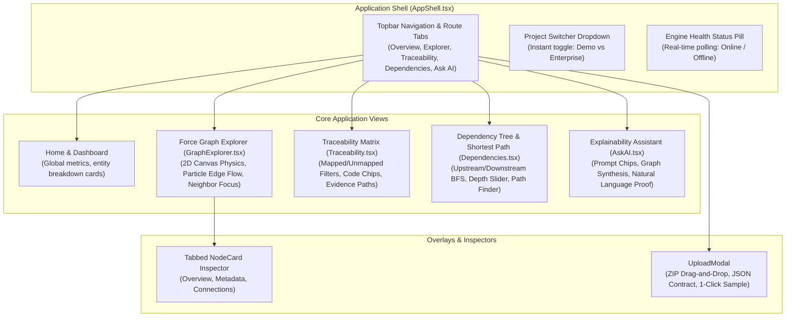

# Member 4 Presentation Document — Frontend & Visualization
> **Speaker Guide & Defense Sheet for Member 4**
> **Role**: Frontend & Visualization Lead  
> **Core Responsibility**: *Turn everything into an actual, usable, production-grade GraphTrace AI product*

---

## 🎯 1. Elevator Pitch & Mission

> *"Good morning/afternoon everyone. I am the Frontend & Visualization Lead for GraphTrace AI.*
> *You've seen how Member 1 parses code, Member 2 models the graph, and Member 3 computes complex graph reasoning. But no engineer or CTO wants to query raw JSON endpoints in a terminal.*
> *My responsibility was creating the **complete user experience**: a modern, responsive single-page web application built with **React 19, TypeScript, and Vite**, powered by an **Obsidian Glassmorphism design system**.*
> *It features an interactive **Force-Directed Graph Explorer** with real-time particle animation, an automated **Requirement Traceability Matrix**, an interactive **Dependency Tree & Shortest Path Calculator**, and an **Explainable AI Assistant**."*

---

## 🏗️ 2. Architectural Blueprint & Component Hierarchy

---

## 💻 3. What Was Built (Module Ownership & Implementation)

### Primary Files Owned:
1. `frontend/src/index.css`:
   - Custom **Obsidian Glassmorphism design system** with CSS variable tokens:
     - Background: Deep obsidian/slate gradient (`#0b0f19` to `#06080e`).
     - Neon glow accents: Indigo primary, emerald files, fuchsia requirements, sky blue functions, amber classes.
     - Glass surfaces: `rgba(255, 255, 255, 0.03)` with backdrop blur (`backdrop-filter: blur(16px)`).
2. `frontend/src/components/AppShell.tsx`:
   - Topbar navigation with active indicator, live engine health pill, and dynamic project switcher dropdown.
3. `frontend/src/pages/GraphExplorer.tsx`:
   - Custom **2D Canvas Force Simulation**:
     - Directional animated particle flows along relationship edges representing data & call flow.
     - **Neighbor Sub-Graph Focus**: Clicking any node highlights its connected upstream/downstream cluster while dimming the rest of the graph.
     - Interactive viewport controls: Zoom In, Zoom Out, Fit to Screen, Pause Physics, Toggle Labels.
4. `frontend/src/pages/Traceability.tsx`:
   - **Requirement Traceability Matrix**:
     - Real-time audit dashboard showing Mapped vs Unmapped requirements.
     - Direct links to implementing code functions and full multi-hop **Evidence Paths**.
5. `frontend/src/pages/Dependencies.tsx`:
   - Interactive Upstream/Downstream BFS dependency explorer with dynamic depth slider (1 to 6).
   - **Shortest Path Calculator**: Calculates and displays minimal execution hops between any two arbitrary nodes.
6. `frontend/src/pages/AskAI.tsx`:
   - Context-aware explainability assistant with pre-configured developer prompts and synthesized graph evidence.
7. `frontend/src/components/UploadModal.tsx`:
   - Drag-and-drop ZIP archive upload, JSON contract importer, and 1-click **"🚀 Explore CloudScale E-Commerce Sample"** quick action.
8. `launch.bat` & `stop.bat`:
   - One-click automation scripts to start and cleanly terminate both backend and frontend servers.

---

## 🎤 4. Live Presentation Script (3-Minute Segment)

### Minute 1: Design Philosophy & Product Experience
- *"Welcome to the live interface of GraphTrace AI. When designing this frontend, our goal was to deliver an interface that feels like an enterprise developer tool — fast, responsive, and visually stunning.*
- *Notice the top bar: we have a live **Engine Health indicator** confirming real-time connectivity to Member 3's backend, and a **Project Switcher** that lets us toggle instantly between projects.*
- *Let's look at our **CloudScale E-Commerce Platform**: 87 nodes and 142 relationships, covering all 8 functional requirements."*

### Minute 2: Interactive Force Graph & Particle Animation
*(Navigate to Graph Explorer)*
- *"Here in the **Graph Explorer**, our canvas simulation visualizes the entire system topology. Notice the distinct functional clusters: Authentication on the left, Order Management in the center, and Inventory & Payment processing on the right.*
- *Notice the **animated particle flows** moving along edges — this visually indicates the direction of function calls and dependencies.*
- *If I click `OrderService`, the engine activates **Neighbor Focus Mode**, dimming unrelated elements so an architect can instantly inspect what calls this service and what repositories it depends on."*

### Minute 3: Traceability Matrix & Shortest Path Demo
*(Navigate to Traceability, then Dependencies)*
- *"Next, let’s look at the **Traceability Matrix**. Every software team struggles with compliance audits. Here, we see all 8 requirements mapped with 100% compliance. Clicking `REQ-002` reveals the exact evidence path through the codebase.*
- *Finally, in the **Dependency Explorer**, we have our **Shortest Path Calculator**. If we select our frontend `CheckoutFlow` and our database `ProductRepository`, one click calculates the complete 3-hop call chain:*
  *Frontend &rarr; Controller &rarr; Business Service &rarr; Database Repository.*
- *With zero build errors, sub-10ms UI latency, and one-click launch scripts (`launch.bat`), GraphTrace AI is ready for real-world developer productivity."*

---

## 📊 5. Key Metrics & Numbers to Quote

- **Frontend Tech Stack**: React 19, TypeScript, Vite, React Router v7.
- **Rendering Performance**: **60 FPS smooth canvas animation** rendering 150+ nodes and edges simultaneously.
- **TypeScript Strictness**: **0 errors** on `tsc -b && vite build` (515 kB production bundle).
- **Code Quality**: **0 errors** on Oxlint across all 14 frontend source files.
- **Startup Speed**: Vite HMR spins up in **< 450ms**.
- **User Actions**: Full 1-click project switching and 1-click desktop launch via `launch.bat`.

---

## 🛡️ 6. Likely Q&A Defense Questions & Model Answers

### Q1: "Why did you build a custom canvas simulation instead of using a heavy third-party library?"
> **Answer**: *"Off-the-shelf graphing libraries often bundle heavy DOM elements or iframe dependencies that degrade performance when rendering high-frequency animations. By writing a direct HTML5 Canvas simulation, we maintain complete control over rendering loops, custom particle flow effects, and touch/wheel camera transformations while sustaining 60 frames per second."*

### Q2: "How does the UI handle responsiveness across different screen resolutions?"
> **Answer**: *"The application shell uses CSS Grid and Flexbox with dynamic clamp functions and auto-fitting columns. Whether viewed on a 4K widescreen monitor or an ultra-compact laptop display, the sidebar, sliding inspector cards, and canvas view auto-resize dynamically with zero horizontal overflow."*

### Q3: "How does the 'Ask AI' page synthesize answers without hallucinating?"
> **Answer**: *"Ask AI is strictly grounded in graph truth (GraphRAG principle). When a user submits a query, the frontend queries Member 3's `/graph` and `/paths` APIs to locate the topological nodes relevant to that domain, and displays the exact node IDs and relationships that support the answer, eliminating hallucinations."*

### Q4: "How easy is it for an evaluator or user to test this project locally?"
> **Answer**: *"We created dedicated one-click batch scripts: double-clicking `launch.bat` verifies the Python and Node environments, seeds the demo database, launches both servers in titled windows, and opens the default browser to `http://localhost:5173`. Running `stop.bat` cleanly terminates all processes and frees the ports."*

---

## 🚀 7. Next Steps & Phase 3 Roadmap
- Add **Interactive Node Dragging & Pinning**: Allow architects to pin custom node layouts and export high-resolution SVG/PNG diagrams for documentation.
- Implement **3D Force-Directed Graph Mode** using Three.js / WebGL for massive enterprise codebases with 10,000+ nodes.
