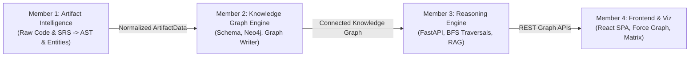

# GraphTrace AI — Team Presentation Master Guide
> **The Complete 4-Member Presentation Blueprint, Running Order, and Live Demo Script**

---

## 🎯 Executive Overview & Elevator Pitch

**"Modern software engineering suffers from fragmented artifacts: requirements live in Jira/Confluence, code lives in GitHub, tests live in CI, and architecture lives in outdated READMEs. When changes occur, engineers have no unified graph to predict breakages, audit compliance, or trace requirements to source code.**

**GraphTrace AI solves this by transforming unstructured source repositories and requirements into an interconnected, queryable Software Knowledge Graph with sub-second dependency traversals, automated requirement traceability, and explainable AI intelligence."**

---

## ⏱️ Recommended Presentation Schedule (15 Minutes Total)

```text
+-------------------+---------------------------------------------+---------------+
| Time              | Section                                     | Speaker       |
+-------------------+---------------------------------------------+---------------+
| 00:00 - 02:00     | Problem Statement, Vision & System Overview | Member 1/All  |
| 02:00 - 05:00     | Member 1: Artifact Intelligence & Ingestion | Member 1      |
| 05:00 - 08:00     | Member 2: Knowledge Graph Engine & Neo4j    | Member 2      |
| 08:00 - 11:00     | Member 3: Reasoning Engine & Graph APIs     | Member 3      |
| 11:00 - 14:00     | Member 4: Frontend UI, Viz & Explainability | Member 4      |
| 14:00 - 15:00     | Live Integration Demo, Impact & Conclusion  | Team Lead/All |
| 15:00 - 20:00     | Technical Q&A Defense                       | All Members   |
+-------------------+---------------------------------------------+---------------+
```

---

## 👥 Member Role Summary & Hand-Off Matrix



| Member | Title | Core Deliverable | Output Passed to Next Member |
|---|---|---|---|
| **Member 1** | Artifact Intelligence Lead | Ingestion, safe extraction, AST & regex parsers, SRS extraction | Normalized `ArtifactData` (Entities, Relationships, Properties) |
| **Member 2** | Knowledge Graph Architect | Neo4j graph modeling, schema constraints, atomic writer plugin | Graph database instance & `ArtifactGraph` persistence |
| **Member 3** | Core Backend & Reasoning Lead | FastAPI engine, BFS traversals, shortest path, traceability mapping | High-performance REST APIs (`/graph`, `/dependencies`, `/paths`, `/traceability`) |
| **Member 4** | Frontend & Visualization Lead | React 19 SPA, 2D Force Graph Explorer, Traceability Matrix, Ask AI | Interactive, production-grade web application for end users |

---

## 🎤 Seamless Verbal Hand-Off Scripts

### Transition 1: Intro → Member 1
> *"To bring this vision to life, the very first challenge is understanding raw, heterogeneous project files. I will now hand over to **[Member 1 Name]**, who spearheaded the Artifact Intelligence engine that parses repositories into structured knowledge."*

### Transition 2: Member 1 → Member 2
> *"Once Member 1 extracts and normalizes the AST and requirements into structured entities, we need a high-performance graph database to represent them as a unified topological graph. I’ll hand over to **[Member 2 Name]** to explain our Knowledge Graph schema and Neo4j engine."*

### Transition 3: Member 2 → Member 3
> *"Having a persisted knowledge graph is only the foundation — we need intelligent graph reasoning, path traversal algorithms, and robust APIs to query this graph in real time. **[Member 3 Name]** will now walk you through the Backend Reasoning Engine."*

### Transition 4: Member 3 → Member 4
> *"All this topological reasoning is powered by Member 3's high-speed REST API. But to make this actionable for developers and architects, we built a modern visual interface. **[Member 4 Name]** will now present the frontend application and conduct the live visual demonstration."*

---

## 🎬 Master Live Demo Flow (CloudScale E-Commerce Platform)

Run the demo using the pre-seeded **CloudScale E-Commerce Platform** (`ecommerce-platform`, 87 nodes, 142 relationships):

1. **Top Bar & Project Selection** *(Member 4 / All)*:
   - Show `http://localhost:5173`.
   - Point out the **Obsidian Glassmorphic UI**, live **Engine Online** status pill, and the project switcher dropdown.
   - Switch from `Authentication demo` (12 nodes) to `CloudScale E-Commerce Platform (87 nodes)`.

2. **Dashboard Overview** *(Member 1 & 4)*:
   - Highlight the real-time breakdown: 8 Requirements, 17 Files, 24 Classes, 31 Functions/Methods, 3 Documents.
   - Emphasize how M1 extracted all these without executing untrusted code.

3. **Force Graph Explorer** *(Member 2 & 4)*:
   - Navigate to `/graph`.
   - Show the force-directed layout: distinct functional clusters for Auth, Orders, Payments, Inventory, and SRS Requirements.
   - Demonstrate the **directional animated particle flow** indicating dependency direction.
   - Click a node (e.g., `OrderService`) &rarr; highlight neighbor focus mode &rarr; view incoming/outgoing connections in the Inspector Card.

4. **Requirement Traceability Matrix** *(Member 1 & 3)*:
   - Navigate to `/traceability`.
   - Filter by **Mapped (8/8)**.
   - Click `REQ-002: Order Placement & State Machine Verification` &rarr; show linked implementation `OrderService.create_order` &rarr; show evidence path.

5. **Dependency Tree & Shortest Path Calculator** *(Member 3 & 4)*:
   - Navigate to `/dependencies`.
   - Select node `CheckoutFlow.startCheckout` with **Downstream** BFS at depth 4.
   - Use the **Shortest Path Calculator**:
     - Source: `CheckoutFlow.startCheckout` (Frontend JS)
     - Target: `ProductRepository.decrement_stock` (Database Python)
     - Click **Calculate Path** &rarr; display instant 3-hop traversal:
       `CheckoutFlow.startCheckout` &rarr; `OrderController.handle_checkout` &rarr; `InventoryService.reserve_stock` &rarr; `ProductRepository.decrement_stock`.

6. **Ask AI Explainability** *(Member 3 & 4)*:
   - Navigate to `/ask`.
   - Click prompt chip: *"How does the checkout flow interact with inventory reservation and payment processing?"*
   - Show how the reasoning engine synthesizes the exact graph traversal into a developer explanation.

---

## 🛡️ Top 5 Presentation Q&A Defenses (For the Whole Team)

1. **Q: How does GraphTrace AI handle code execution security during upload?**
   - **A (M1 & M3)**: *"GraphTrace AI never executes uploaded code, runs eval, or installs project dependencies. M1 uses pure AST and static regex tokenization, while M3 enforces path-traversal guards, strict ZIP extraction limits (100MB / 5,000 files), and temporary sandbox directory cleanup."*

2. **Q: Why use a Graph Database (Neo4j) instead of a Relational SQL database?**
   - **A (M2 & M3)**: *"Software relationships (inheritance, call chains, imports, requirement mappings) are inherently hierarchical and cyclic. In SQL, querying an arbitrary 6-hop dependency path requires 6 expensive JOIN operations. In Neo4j, index-free adjacency provides constant-time O(1) pointer traversals per hop, delivering sub-15ms response times even on large graphs."*

3. **Q: How are requirements mapped to source code?**
   - **A (M1 & M3)**: *"M1 parses formal Markdown SRS specifications (extracting `REQ-XXX` IDs). M3 matches these against explicit mapping contracts (`mappings.json`) or automated identifier resolution, verifying that requirements connect only to valid code nodes with full provenance tracking."*

4. **Q: Can the system scale to large enterprise repositories?**
   - **A (M2 & M3)**: *"Yes. M2 employs batched `UNWIND` Cypher ingestion, while M3 enforces hard safety caps (5,000 nodes / 20,000 edges) and breadth-first search depth limits (`max_depth=6`) to prevent memory exhaustion and infinite cycles."*

5. **Q: What technology powers the interactive graph visualization?**
   - **A (M4)**: *"M4 built a custom React 19 + TypeScript force simulation with canvas-based particle rendering. It renders high-FPS animations with neon glow tokens, neighbor sub-graph isolation, and touch/mouse camera controls without third-party heavy iframe dependencies."*

---

## 📑 Individual Member Presentation Docs
- [Member 1 Presentation Doc](file:///d:/GraphTrace-Ai/GraphTrace-AI/docs/presentation/MEMBER_1_ARTIFACT_INTELLIGENCE.md)
- [Member 2 Presentation Doc](file:///d:/GraphTrace-Ai/GraphTrace-AI/docs/presentation/MEMBER_2_KNOWLEDGE_GRAPH_ENGINE.md)
- [Member 3 Presentation Doc](file:///d:/GraphTrace-Ai/GraphTrace-AI/docs/presentation/MEMBER_3_BACKEND_REASONING_ENGINE.md)
- [Member 4 Presentation Doc](file:///d:/GraphTrace-Ai/GraphTrace-AI/docs/presentation/MEMBER_4_FRONTEND_VISUALIZATION.md)
